# Progress over time

Documenting the images generated by the raytracer over time.

# 1.0

This is the graphics “hello world”.

# 1.2

A blue-to-white gradient depending on ray Y coordinate

# 1.3

A simple red sphere

# 1.4

A sphere colored according to its normal vectors

Resulting render of normals-colored sphere with ground

# 1.5

Added antialiasing.

# 1.6

First render of a diffuse sphere

Diffuse sphere with no shadow acne

Correct rendering of Lambertian spheres

Testing the gamut of the renderer so far, at 10%, 30%, 50%, 70% and 90% reflectance

The gamut of the renderer, gamma-corrected

# 1.7

Shiny metal

Fuzzed metal

# 1.8

Glass sphere that always refracts

Air bubble sometimes refracts, sometimes reflects

A hollow glass sphere

# 1.9

A wide-angle view

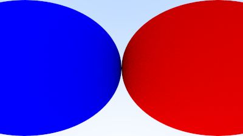

A distant view

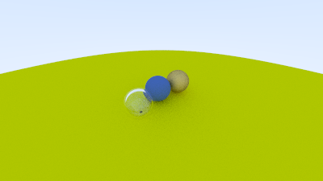

Zooming in

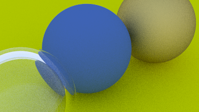

# 1.10

Spheres with depth-of-field

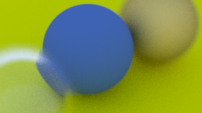

# 1.11

Final scene

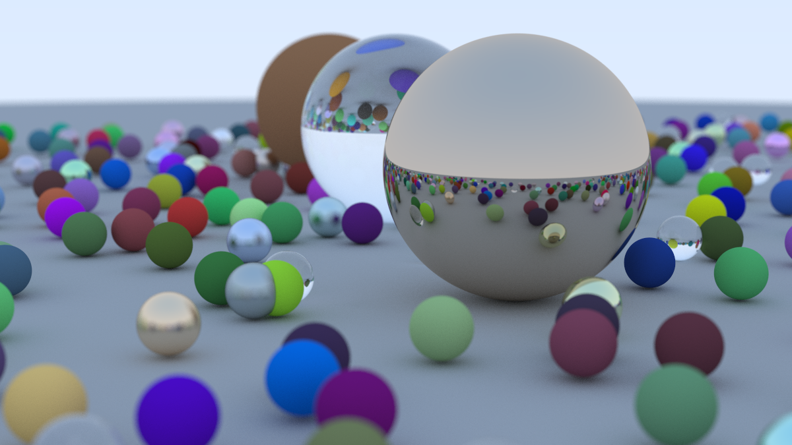

# 2.0

Bouncing spheres

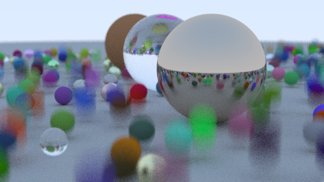

# 2.2

Spheres on checkered ground

Checkered spheres

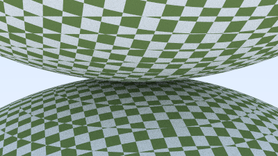

Earth-mapped sphere

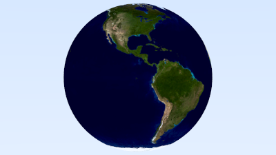

# 2.3

Hashed random texture

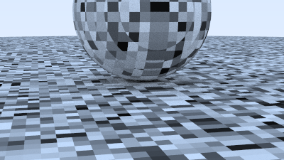

Perlin texture with trilinear interpolation

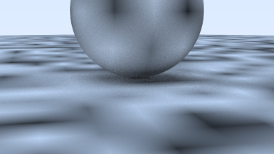

Perlin texture, trilinearly interpolated, smoothed

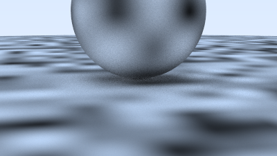

Perlin texture, higher frequency

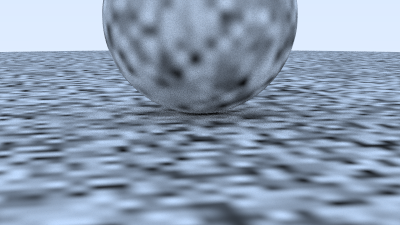

Perlin texture, shifted off integer values

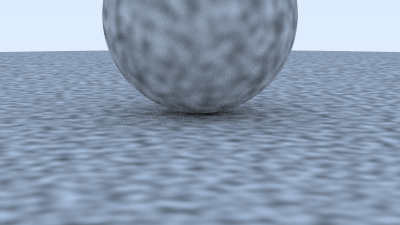
